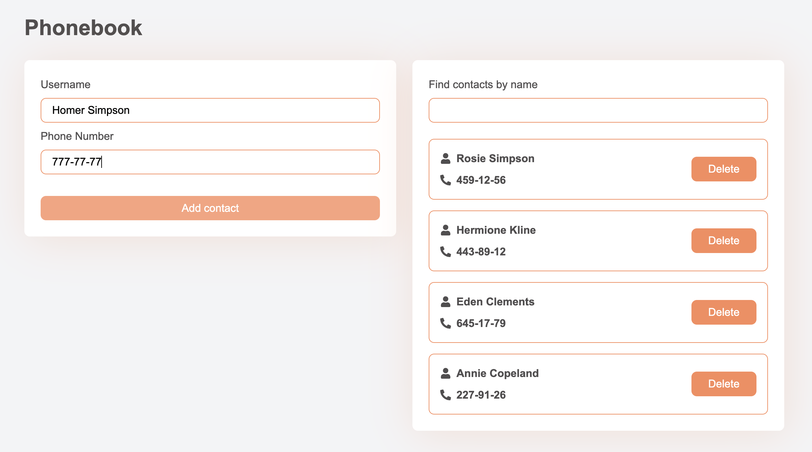

# React

## Module 1: Components, Props, Vite

### Task 1 - Social Media Profile Component\*\*

1.  Create a <Profile> component that accepts the following props: name, tag, location, image, and stats.

2.  Structure the component to display the user's information dynamically, based on the passed props.

3.  Move the user data into a JSON file (userData.json) in the src directory and format it in JSON.

4.  Import the user data from the JSON file into the App component.

5.  Pass the imported data as props to the <Profile> component within the App component.

### Task 2 - Friend List Component\*\*

1.  Create a <FriendList> component that accepts a friends prop, which is an array of friend objects.

2.  Create a <FriendListItem> component that accepts avatar, name, and isOnline props.

3.  In <FriendList>, render a list of <FriendListItem> components based on the friends array.

4.  Conditionally render the text and style in <FriendListItem> based on the isOnline prop.

5.  Move the friends' data into a JSON file (friends.json) in the src directory and format it in JSON.

6.  Import the friends' data from the JSON file into the App component.

7.  Pass the imported data as props to the <FriendList> component within the App component.

### Task 3 - Transaction History Component\*\*

1.  Create a <TransactionHistory> component that accepts an items prop, which is an array of transaction objects.

2.  Structure the component to display a table with the transaction data, including columns for Type, Amount, and Currency.

3.  Move the transactions' data into a JSON file (transactions.json) in the src directory and format it in JSON.

4.  Import the transactions' data from the JSON file into the App component.

5.  Pass the imported data as props to the <TransactionHistory> component within the App component.

---

## Acknowledgments

[GOIT](https://edu.goit.global/uk/referral?x=eyJlbWFpbCI6InNvcmxlbmtAZ21haWwuY29tIiwiZmlyc3ROYW1lIjoi0KHQtdGA0LPRltC5IiwibG9jYWxlIjoidWsiLCJsYW5ndWFnZSI6InVrIiwidG90YWxIb3VycyI6NzcsImN1cnJlbnRPckxhc3RUZWNobm9sb2d5IjoiSFRNTF9DU1MiLCJwYXNzZWRIb21ld29ya3NDb3VudCI6NX0=) -
big love to GoIT team for their patience, afford, help, and positivity that they
share with us ❤️

## Author

- Website - [www.grifano.com](https://grifano.com)
- Frontend Mentor -
  [www.frontendmentor.com](https://www.frontendmentor.io/profile/grifano)
- LinkedIn - [www.linkedin.com](https://www.linkedin.com/in/grifano/)
